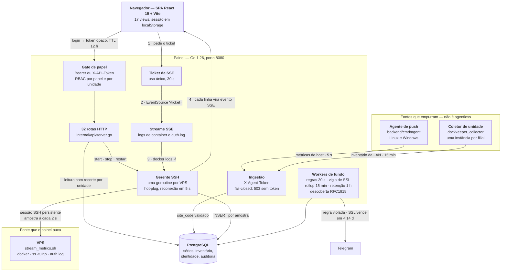

# DockKeeper

Painel de monitoramento de infraestrutura: métricas de host em tempo real,
containers Docker, inventário da rede local, validade de certificados SSL e
alertas no Telegram — com controle de acesso por papel e por unidade.

Backend em Go, frontend em React + Vite, dados em PostgreSQL.

---

## Números

| Medida | Valor |
|---|---|
| Linhas de Go | 19.909 |
| Linhas de Go em teste | 9.060 — **45,5% do código Go** |
| Funções de teste | 292 |
| Pacotes internos | 10 — `alert`, `api`, `audit`, `auth`, `database`, `discovery`, `logstore`, `network`, `rules`, `ssh` |
| ADRs | 8, cada uma com contexto, decisão e consequência |
| Rotas HTTP registradas | 32 |

Contagem feita sobre os arquivos rastreados pelo git, em 10/09/2026.

O CI roda em todo pull request e em todo push para `main`, com um Postgres de
verdade como serviço: `gofmt` com conferência da saída, `go vet`, `go build`,
`go test -race`, `tsc -b`, `oxlint`, `vitest` e `build`. Mais dois passos que
existem por causa de incidente, não de checklist: um injeta um canário em
`VITE_API_TOKEN` e falha se o valor aparecer em qualquer arquivo do bundle de
produção; o outro roda `gitleaks` na árvore e no histórico de todas as branches,
para que um segredo commitado e removido no commit seguinte continue sendo
pego.

[](https://github.com/jvS0uzx/dock_keeper/actions/workflows/ci.yml)

<!--
GIF de demonstração: ainda não gravado. Quando o arquivo existir, troque este
comentário inteiro pela tag abaixo. A tag fica comentada até lá porque imagem
apontando para arquivo inexistente rende ícone de imagem quebrada no GitHub, o
que é pior que não ter imagem.


Roteiro, 20 segundos, nesta ordem:
  1. o gráfico de métrica se movendo sozinho, sem nenhuma interação na tela;
  2. o log chegando em streaming pelo SSE;
  3. um restart de container, com o estado mudando na tela.

Gravar e cortar:
  wf-recorder -g "$(slurp)" -f /tmp/demo.mp4    (no X11, use o peek)
  ffmpeg -i /tmp/demo.mp4 -t 20 \
    -vf "fps=12,scale=900:-1:flags=lanczos,split[a][b];[a]palettegen[p];[b][p]paletteuse" \
    -loop 0 docs/img/dockkeeper-demo.gif

Manter abaixo de 5 MB. Se passar, baixe o fps para 10 ou a largura para 800.
-->

---

## Arquitetura

Quatro fontes de dado alimentam o mesmo banco: o painel puxa por SSH, o agente
de estação e o coletor de unidade empurram, e a descoberta varre a rede local
onde o painel roda. O que cada uma faz e o que cada uma **não** faz está em
[`docs/arquitetura.md`](docs/arquitetura.md).



---

## O que ele faz

| Recurso | Como funciona |
|---|---|
| Métricas de host | CPU, memória, disco, load, uptime e temperatura, por SSH ou por agente de push |
| Containers Docker | Lista, estado, consumo, e ações `start` / `stop` / `restart` no host remoto |
| Logs em tempo real | `docker logs -f` e `/var/log/auth.log` transmitidos por **SSE** |
| Inventário de rede | Varredura de faixas RFC1918, com cadastro de sala, dono e patrimônio |
| Plantas baixas | Marcadores posicionados sobre a imagem da planta, com estado do host ao vivo |
| Certificados SSL | Verificação de cadeia, hostname e validade, com alerta de expiração |
| Alertas | Regras sobre métricas, com severidade, dependência entre hosts e duração mínima |
| Auditoria | Toda escrita e todo comando remoto registrados com ator, alvo e resultado |

**Não é agentless.** O repositório contém dois coletores próprios além da coleta
por SSH — veja [Fontes de dado](docs/arquitetura.md).

---

## Documentação

| Arquivo | Conteúdo |
|---|---|
| [`docs/arquitetura.md`](docs/arquitetura.md) | As quatro fontes de dado e o que cada uma **não** faz |
| [`docs/configuracao.md`](docs/configuracao.md) | Todas as variáveis de ambiente, com padrão e efeito |
| [`docs/autenticacao.md`](docs/autenticacao.md) | Papéis, RBAC por unidade e o que "concessão global" significa |
| [`docs/api.md`](docs/api.md) | As rotas, com método e papel exigido |
| [`docs/metricas.md`](docs/metricas.md) | Semântica das métricas — **nulo não é zero** |
| [`docs/agente.md`](docs/agente.md) | Agente de push: instalação e identidade por dispositivo |
| [`docs/inventario-de-rede.md`](docs/inventario-de-rede.md) | Varredura local, coletor remoto e a chave `(unidade, ip)` |
| [`docs/operacao.md`](docs/operacao.md) | Retenção, poda, auditoria e o que olhar quando quebra |
| [`docs/dependencias.md`](docs/dependencias.md) | O que o sistema exige do host monitorado e do painel |
| [`docs/adr/`](docs/adr/) | Decisões de arquitetura, com contexto e consequência |

---

## Limites conhecidos

- **O inventário de rede não funciona bem em container.** A varredura lê
  `/proc/net/arp`, que dentro de um container é a tabela do *namespace*, não a do
  host. Quem depende dela precisa de `network_mode: host` ou do coletor remoto.
- **A tela de descoberta de SSL depende do access log do Nginx.** Sem um host com
  `collect_nginx` ligado, ela fica vazia — não há erro, não há o que descobrir.
- **Não há prober de rede.** O que o painel chama de handshake SSH é o tempo de
  abrir a sessão inteira (TCP + troca de chaves), uma ordem de grandeza acima do
  RTT. Ver [`docs/metricas.md`](docs/metricas.md).
- **Uma chave SSH única para toda a frota.** `SSH_KEY_PATH` é uma só chave, por
  padrão `root`. Comprometer o host do painel é comprometer a frota. A redução
  disponível: usuário dedicado `vd-monitor` com grupos e sudoers mínimos — ver
  [`docs/operacao.md`](docs/operacao.md) e
  [`backend/deploy/sudoers-vd-monitor.exemplo`](backend/deploy/sudoers-vd-monitor.exemplo).
- **Sessões vivem no banco, mas o cooldown de alerta também.** Com o banco
  indisponível o painel recusa login e passa a notificar sem deduplicar — falha
  aberta de propósito, porque alerta duplicado incomoda e alerta perdido mata.

---

## Subindo o painel

### Pré-requisitos

- Go 1.26 ou superior (o `go.mod` declara `go 1.26.5`)
- Node.js 22 ou superior — o `Dockerfile` e o CI usam 22
- PostgreSQL 15 ou superior
- Uma chave SSH com acesso aos hosts que serão monitorados

As dependências de sistema dos hosts monitorados estão em
[`docs/dependencias.md`](docs/dependencias.md). Elas não são opcionais: sem `ss`
o radar de portas fica vazio, sem `/sys/class/hwmon` não há temperatura.

### 1. Configuração

```bash
cp .env.example .env
chmod 600 .env
```

Três variáveis **impedem o processo de subir** se estiverem ausentes ou erradas:

| Variável | Por quê |
|---|---|
| `DATABASE_URL` | Sem banco não há o que servir |
| `API_TOKEN` | Fail-closed: o painel comanda SSH como root, e uma porta aberta entrega o parque. Gere com `openssl rand -hex 32` |
| `SSH_KNOWN_HOSTS` | O painel **recusa subir** sem verificar host key |

Sobre a terceira: até pouco tempo o painel caía em silêncio para "aceita
qualquer host key", registrando só um aviso. Um painel que roda comando como
root por SSH nessa condição está aberto a máquina no meio. Popule o arquivo com

```bash
ssh-keyscan -H 10.0.0.1 10.0.0.2 >> ~/.ssh/known_hosts
```

e **confira as impressões digitais fora de banda** antes de confiar nelas — um
`ssh-keyscan` numa rede já comprometida grava a chave do atacante com a mesma
naturalidade. Detalhes em [`backend/deploy/README.md`](backend/deploy/README.md).

Para laboratório, `SSH_INSECURE_HOST_KEY=true` desliga a verificação, com aviso
alto no log a cada conexão.

As mais de 40 variáveis estão documentadas em
[`docs/configuracao.md`](docs/configuracao.md) e comentadas no próprio
`.env.example`.

### 2. Primeiro usuário — sem isto você não entra

Só um administrador cria outro usuário, então uma instalação nova precisa de
alguém para começar. `ADMIN_USER` e `ADMIN_PASSWORD` no `.env` criam esse
primeiro administrador **na primeira subida**:

```env
ADMIN_USER="admin"
ADMIN_PASSWORD="uma-senha-de-no-minimo-10-caracteres"
```

O que o código faz, exatamente (`backend/internal/auth/bootstrap.go`):

- roda uma vez, **só se a tabela de usuários estiver vazia**;
- havendo qualquer usuário, não faz nada — deixar as variáveis no `.env` não
  recria nem sobrescreve ninguém;
- a senha precisa de **ao menos 10 caracteres**, senão a criação é recusada com
  `ADMIN_PASSWORD recusada` no log e nenhum usuário nasce;
- sem as duas variáveis, o log diz
  `nenhum usuário cadastrado. Defina ADMIN_USER e ADMIN_PASSWORD no .env`.

O usuário nasce com papel `admin` e **concessão global**. Remova
`ADMIN_PASSWORD` do `.env` depois do primeiro acesso.

### 3. Banco

Com Docker:

```bash
docker compose up -d postgres
```

⚠️ O `docker-compose.yml` exige `POSTGRES_PASSWORD` e recusa subir sem ela, mas
essa variável **não está no `.env.example`**. Acrescente ao seu `.env` antes de
rodar o compose:

```env
POSTGRES_PASSWORD="a-mesma-senha-que-esta-na-DATABASE_URL"
```

O compose publica o Postgres em **5433** por padrão (`POSTGRES_PORT`), e não em
5432, para não conflitar com um Postgres já instalado na máquina. A
`DATABASE_URL` do `.env.example` aponta para a mesma porta — as duas divergiam,
e quem seguisse os dois arquivos literalmente conectava na porta errada sem
receber pista do motivo.

As tabelas são criadas sozinhas no boot, por `AutoMigrate`. Não há passo de
migração manual.

### 4. Backend

```bash
cd backend
go mod tidy
go run ./cmd/dockkeeper
```

A API sobe em `:8080` (`API_ADDR` muda).

### 5. Frontend

```bash
cd frontend
npm install
npm run dev
```

O Vite serve em `http://localhost:5173`, que é o valor padrão de
`ALLOWED_ORIGINS`.

---

## Verificação

Todos os comandos abaixo foram executados neste repositório.

```bash
# Backend
cd backend
gofmt -l .          # precisa sair vazio
go vet ./...
go build ./...
go test ./...       # testes de integração pulam sem DATABASE_URL
```

```bash
# Frontend
cd frontend
npm run typecheck   # tsc -b
npx oxlint
npx vitest run
npm run build
```

⚠️ **`npx tsc --noEmit` não checa nada neste projeto.** O `tsconfig.json` da raiz
tem `"files": []` e só referências de projeto, então o comando percorre **0 dos
36 arquivos** de `src/` e passa sempre. Use `npm run typecheck`. Um passo de
verificação que nunca falha é pior que passo nenhum, porque dá a impressão de
cobertura.

Para rodar os testes de integração, aponte um Postgres descartável:

```bash
export DATABASE_URL="postgres://postgres@127.0.0.1:5433/vdstats_test?sslmode=disable"
go test ./...
```

---

## Projetos relacionados

- [dockkeeper_collector](https://github.com/jvS0uzx/dockkeeper_collector) — coletor de inventário por unidade: varre a rede local da filial e faz push para o painel
  em `POST /api/ingest/inventory`, para o painel enxergar redes onde ele mesmo
  não roda. Ver [`docs/inventario-de-rede.md`](docs/inventario-de-rede.md).
- **`backend/cmd/agent`** — agente de push instalado na estação monitorada, com
  instaladores para Linux, Windows e Ansible em
  [`backend/deploy/agent/`](backend/deploy/agent/). Ver
  [`docs/agente.md`](docs/agente.md).

